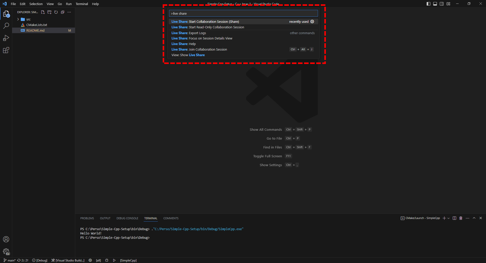

# Simple-Cpp-Setup

🎉 Welcome to this simple C++ template project!<br/>
👩‍💻 It contains everything you need to get started with programming in C++.

- [Installing the tools](#installing-the-tools)
  - [IDE](#ide)
  - [Compiler](#compiler)
  - [CMake](#cmake)
  - [Ninja](#ninja)
- [Creating a repository](#creating-a-repository)
- [Downloading the code on your computer](#downloading-the-code-on-your-computer)
- [Running the code](#running-the-code)
- [Writing code](#writing-code)
- [Useful tips](#useful-tips)
  - [Debugger](#debugger)
  - [Learn the features of VS Code](#learn-the-features-of-vs-code)
  - [Live Share](#live-share)


## Installing the tools

### IDE

We recommend using Visual Studio Code (VSCode) as your IDE (Integrated Development Environment). [You can download it from here.](https://code.visualstudio.com/)

Then you can use this profile to setup your VSCode automatically with all the recommended extensions and settings: https://vscode.dev/profile/github/62cdc1f5620231712084bffdec173115


### Compiler

[Follow the instructions from this lesson.](https://julesfouchy.github.io/Learn--Clean-Code-With-Cpp/lessons/install-a-compiler/)

### CMake

Install CMake from https://cmake.org/download/ (or from your favorite package manager).

### Ninja

Install it by following these instructions: https://github.com/ninja-build/ninja/wiki/Pre-built-Ninja-packages.

## Creating a repository

Make a copy of this repository on your own GitHub account by using `Use this template`.


> **NB:** You might want to remove or change the *LICENSE.txt* file. This template is under the CC0 license, but you might not necessarily want to apply the same license to your project.

> **NB:** If you are not using GitHub but GitLab or anything else, just download the code (using the `Code` dropdown next to `Use this template`), then create a repo on your own, and commit the downloaded code to that repo. `Use this template` is just a convenient shortcut, it is not mandatory.

**NB:** you might also want to change or remove the LICENSE file. Your project does not need to use the same license as the one we use for this template.

## Downloading the code on your computer

Open a terminal in the folder where you want to download this repository, and run:
```bash
git clone [url to the repository you just created]
```

For example in my case this would be:
```bash
git clone https://github.com/JulesFouchy/Simple-Cpp-Setup
```

## Running the code

Open the folder in Visual Studio Code. You should then see something like:


In the bottom section, click the `Run` (triangle) button:


> 💡 If the `Run` button isn't there, it is probably because you did not open the right folder. Maybe you opened the parent of the folder containing the project? Check that in the folder view (framed in red in the previous picture) you have a `CMakeLists.txt` at the root.
If this wasn't the problem, then maybe you didn't install the C++ extensions, or you just need to close and re-open VS Code for the changes to take effect.

The first time, it will ask you which compiler you want to use. You might need to click `Scan for kits`. If you installed everything correctly, you should have at least one compiler in the list. Select one that talks about 64 bit architecture.


Your program should then compile, run, and output "Hello World!"


🎉 **Congrats, you are now ready to start coding!**

## Writing code

Put all your C++ files (*.cpp* and *.hpp*) in the `src` folder. This is where the `CMakeLists.txt` is configured to look for them.

## Useful tips

### Debugger

By using the `Debug` button you can run your code in debug mode. This will show you where problems are coming from if your code crashes, and also allows you to inspect the execution of your program line-by-line and see the values of all the variables.


[Read this lesson to learn how to use a debugger.](https://julesfouchy.github.io/Learn--Clean-Code-With-Cpp/lessons/debugger)

### Learn the features of VS Code

[Check out this lesson for an overview of the most important things that VS Code can do automatically for you.](https://julesfouchy.github.io/Learn--Clean-Code-With-Cpp/lessons/ide/#quick-actions)

### Live Share

One of the extensions installed with the profile we provided is *Live Share*: it allows you to work remotely with your teammates in one single editor, just like a GoogleDoc. It is amazing to work together on projects! <br/>
Use <kbd>CTRL</kbd> + <kbd>SHIFT</kbd> + <kbd>P</kbd> and type "Live Share" to start a collaborative session.

